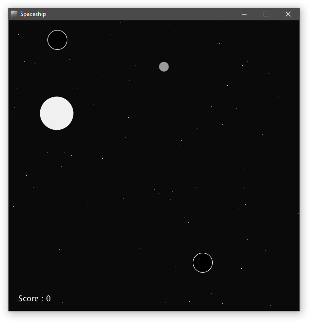

# Spaceship

A 600 by 600 black window has a space craft which can only fly in circles, pressing any key will swap the direction the space craft is flying (Clockwise or Anti-Clockwise). If the craft ever goes off an edge it appears on the opposite edge continuing its motion.

The window also features 100 stars with randomly chosen locations, pressing the 'w','a','s','d' keys will move the stars in the opposite direction.

There is a white wormhole on the screen which appears randomly. This grows and shrinks its size and when the craft collides with it a point is scored and the craft is warped to another point of space, with the wormhole and stars in new random positions.

Screenshot
----

